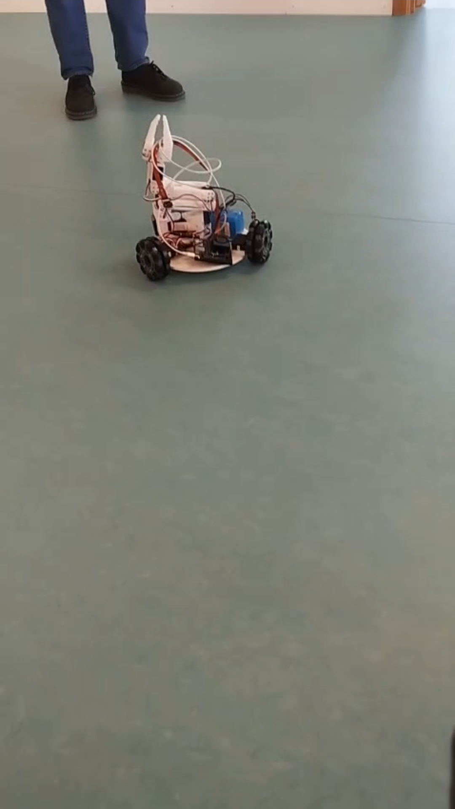

# Social Dog Robot

An autonomous social robot that recognizes a person, plays fetch, and expresses emotions using LED eyes.

 

## Overview

The Social Dog Robot is an interactive robotics project focused on combining:

- Autonomous navigation  
- Computer vision  
- Object manipulation  
- Human-Robot Interaction (HRI)  

The robot is able to recognize a specific person, detect when a ball is thrown, navigate toward the ball, pick it up, and return it to the user.

A strong emphasis is placed on **social interaction**, where the robot communicates emotional states using two 8×8 LED matrix “eyes”.

This project is also used to explore how humans perceive emotions on low-resolution robotic displays.

---

## Features

- Person recognition (owner detection)
- Ball detection and tracking
- Autonomous navigation toward the ball
- Ball pickup using a gripper mechanism
- Return behaviour to the recognized user
- Emotional feedback through animated LED eyes
- Social interaction behaviour loop

---

## Hardware

Main platform:

- LeKiwi robotic base (omnidirectional drive)

Additional components:

- Jetson Orin Nano (main processing unit)
- Camera module for vision tasks
- Motor drivers and omni wheels
- Servo-based gripper
- 2× MAX7219 8×8 LED matrices (eyes)
- LiPo battery and power management

---

## Software

Main subsystems:

### Computer Vision
- Person recognition
- Ball detection (color / shape tracking)
- Direction and distance estimation

### Behaviour Logic
The robot follows a behaviour loop:

Idle → Person Recognized → Ball Thrown → Navigate → Pickup → Return → Emotional Feedback → Idle

### Emotional System

The LED eyes display different emotional states:

- Heart eyes → person recognized
- Blinking → idle
- Fast animation → excitement (ball detected)
- Confused pattern → ball lost

---

## Human-Robot Interaction Research

This robot serves as a platform to investigate:

- Emotional recognizability on low-resolution displays
- User response timing to robot emotions
- Perceived intelligence and engagement during interaction
